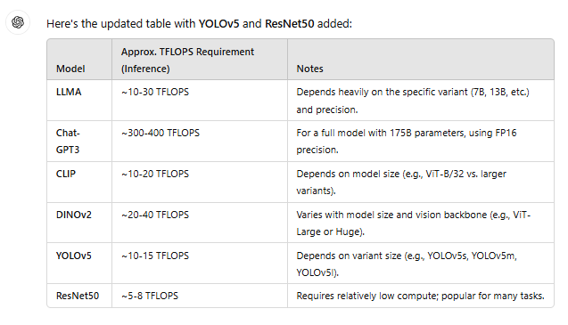
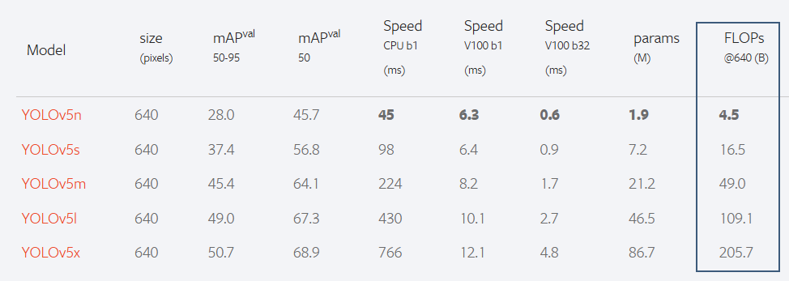

#  Beware GPT Ahead #01 - Agents

2025 have its next hype: Agents. Aiming to give LLM based workflows much bigger freedom and impact than ever.

Is it a good thing? Yes, technology is advancing and we should benefit from it, BUT! - there is always a 'but'.

There is a significant gap between end-user understanding of these models and reality.
I find it misleading and dangerous when token generation is referred to as 'thinking'.
These models are not human-like and do not possess cognitive understanding. In fact this is major weakness of them.

The outputs are always generated with absolute certainty and models never ask for additional information.
Critical thinking is essential and asking the right questions is key to have a deep understanding of the requirements.
Models are helpful and happy to generate unrelated answers based on half information.

Companies are about to deploy these agents and make them important part of their decision making system or even let them act autonomously.
The more we rely on these systems, the greater the potential damage they can cause and it is only a matter of time before they will fail in an unexpected manner.

There are many benefits of using LLMs, but when agents fail the consequences can be impactful. Beware!

----

Let me share a brief conversation I had with GPT-4o today. Just a simple task.
- requested a brief table listing a few popular models with their computational requirements
- extended the table with additional models

Easy-peasy, 30 seconds and you have your table.

Can you trust it? If you can't, what have you truly gained by generating it?

Spoiler! The table is seriously flawed!
If decisions are made based on it, you are in trouble.
It does not matter whether it is you or an agent drawing conclusions and acting on invalid information!

- typical ResNet50 with 224x224 input has ~4 [TFLOP]
- YOLOv5 is in a different ballpark as well

If you can't even trust basic information retrieval, is it really a good idea to deeply rely on agents and let them act autonomously!?

My chatgpt conversation: https://chatgpt.com/share/6788cb00-e914-8001-a6ee-ff0a4b1186ea

additional resources:
- https://pytorch.org/hub/ultralytics_yolov5/
- https://pytorch.org/vision/main/models/generated/torchvision.models.resnet50.html
